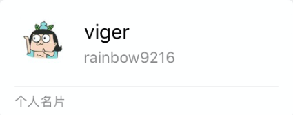
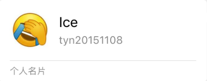
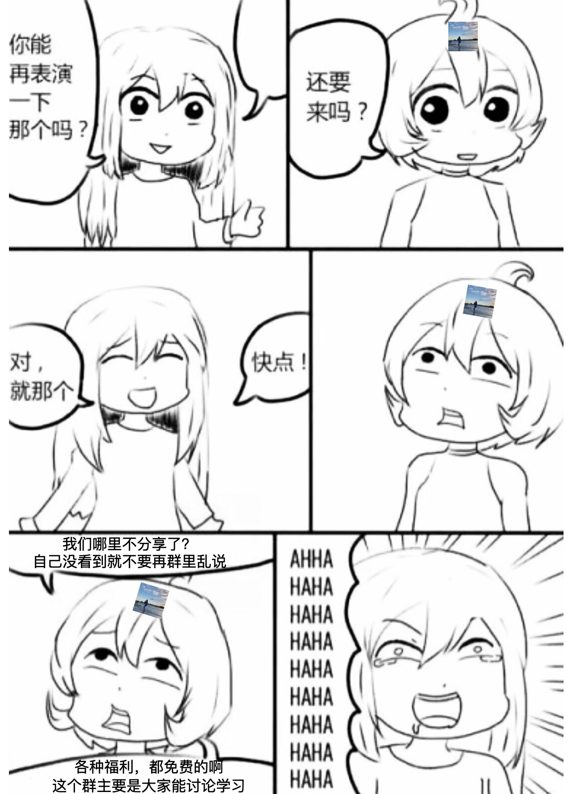
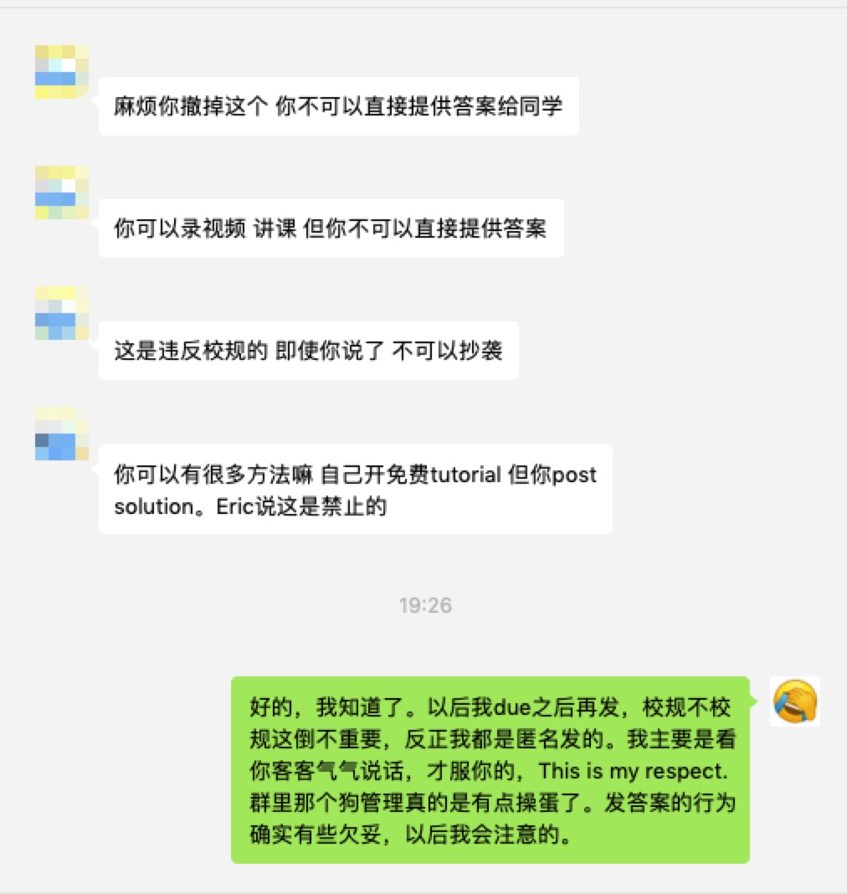

# 欢迎大家加零广告学习交流群

目前群里有接近90个人，这里有思路分析（due前）和代码分享（due后），最最最重要的是**没有广告**。

最后希望大家也不要在广告群里进行答疑回复和资料分享。

因为开启了入群验证，群主说可以加他或我的微信

# COMP9021_19T2

Quiz and assignment of UNSW COMP9021 19T1

#### 9021都学不明白，求求你了趁早转专业吧

仅供学习交流，**不得**作为作业提交，被查重本人概不负责

This repository only for giving you some hints. Please **DO NOT** submit those codes as your quiz or assignment. If you do that, you will take full responsibility for code plagiarism.

代码千万条，自律第一条，借鉴不规范，亲人两行泪
(Codes are countless, Honest is foremost, Academic misconduct, Loved ones end up in tears)

## 排他性

本repository禁止传播到任何和Dueape有关的社区（包括但不仅限于微信群、QQ群、论坛），希望大家遵守这个没有约束的约束

## 退掉广告群

聊天记录我就不贴了，有兴趣的看[新上传的截图](https://github.com/tiancaiji/COMP9021_19T1/tree/master/%E8%81%8A%E5%A4%A9%E6%88%AA%E5%9B%BE)吧。

补习班也要恰饭我当然懂啦，但qiu qiu你不要装得这么正经啦。

我干涉不了别人在自己的群里发广告，但是我可以呼吁大家**不要在广告群里答疑、分享资料**呀

---

群里有人说GitHub能搜到答案，我接了一句是我写的，然后狗管理就把我踢了。

你踢你:horse:呢？我又没在你这个群里发，SB。

